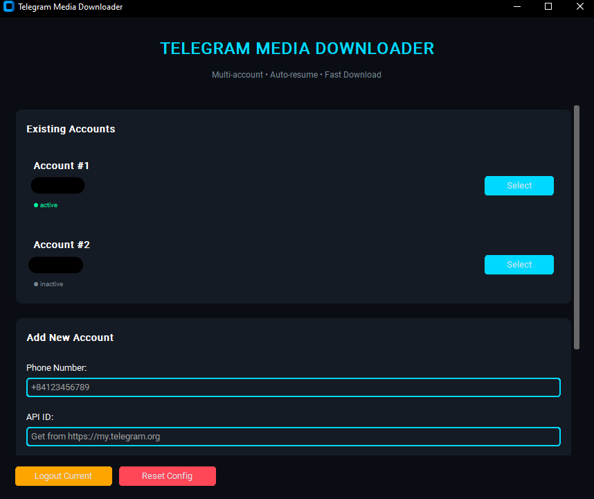
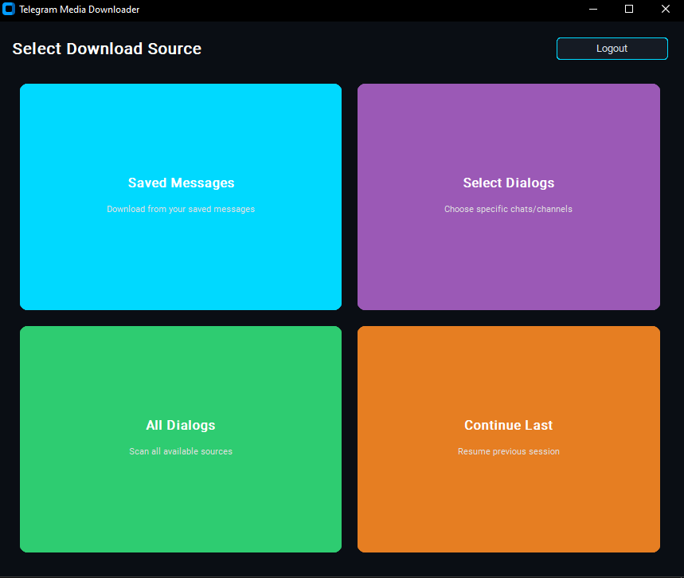
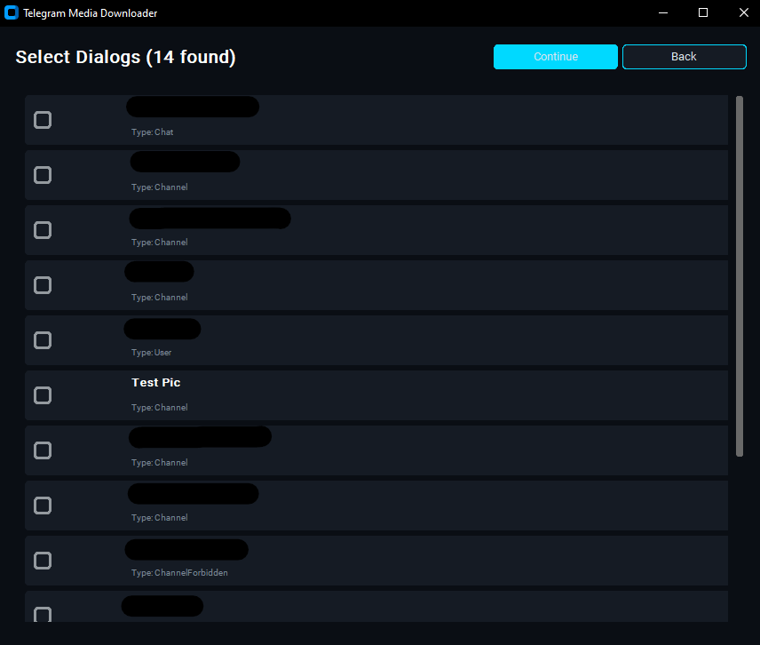
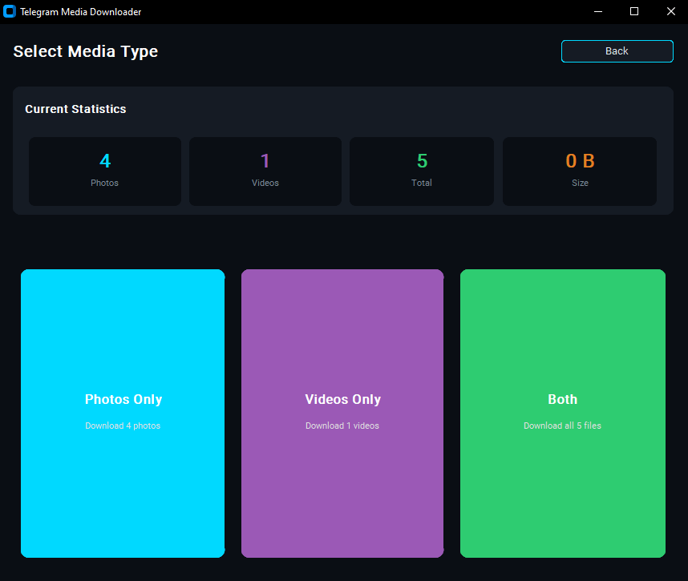
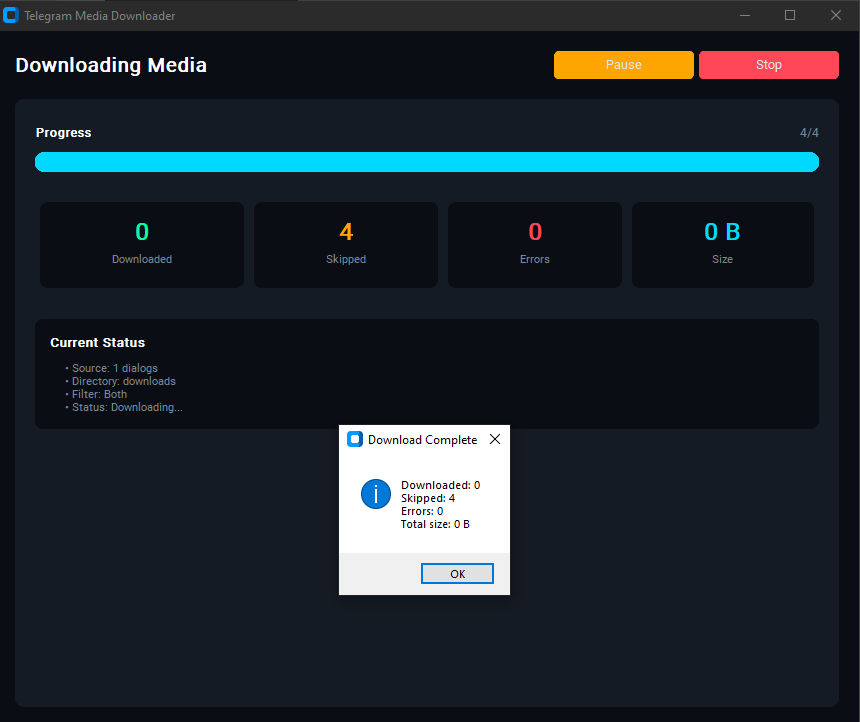

---
# Telegram Media Downloader

Telegram Media Downloader is a multi-account tool that allows you to download photos and videos from your Telegram account. It includes both a **command-line interface (CLI)** and a **modern graphical user interface (GUI)** with a focus on usability and control.

This project supports:

* Multiple accounts via `.env` configuration
* Auto-login and OTP/2FA support
* Filtering by media type (photos, videos, or both)
* Saved Messages and Chat/Channel support
* Resumable downloads with progress tracking

---

## Features

* GUI built with **CustomTkinter** (dark mode with accent color)
* CLI with **fixed-width layout**, friendly messages, and resume support
* Multi-account management via `.env` configuration
* Resume interrupted downloads automatically
* Select individual chats or all conversations for scanning
* Per-account download folders

---

## Installation

### Requirements

* Python 3.9 or later
* Install dependencies:

```bash
pip install telethon tqdm colorama humanize python-dotenv customtkinter
```

---

## Usage

### Command-line Interface (CLI)

Run the CLI tool:

```bash
python downloader.py
```

The CLI version provides:

* Account login via phone number, API ID, and API Hash
* Console-based folder selection
* Resume support via `.resume.json` per account
* Status and statistics tracking for each download session

### Graphical Interface (GUI)

Run the GUI tool:

```bash
python gui_downloader.py
```

The GUI offers:

* Modern dark-mode interface
* Multi-account selection and management
* Source selection: Saved Messages, Custom Dialogs, All Dialogs
* Real-time progress updates with pause/stop/resume options
* Simple, fast, and user-friendly workflow

---

## Screenshots

### Login Screen

Allows adding new accounts or selecting existing ones.



---

### Source Selection

Choose where to download media from.





---

### Media Type Selection

Select which types of media to download.



---

### Download Progress

Live statistics and download progress.



---

## Environment File (`.env`) Structure

Multi-account support is based on environment variables. A sample `.env`:

```env
CURRENT_ACCOUNT=1

ACCOUNT_1_PHONE=+84123456789
ACCOUNT_1_API_ID=123456
ACCOUNT_1_API_HASH=abc123xyz456...
ACCOUNT_1_DOWNLOAD_DIR=downloads/account1

ACCOUNT_2_PHONE=+84987654321
ACCOUNT_2_API_ID=654321
ACCOUNT_2_API_HASH=xyz456abc123...
ACCOUNT_2_DOWNLOAD_DIR=downloads/account2
```

* `CURRENT_ACCOUNT`: Index of the currently active account
* `ACCOUNT_n_*`: Each account's credentials and download directory

---

## Resume Support

The application saves download progress in a `.resume.json` file under each download folder. You can resume downloads even after interruption.

---

## Folder Structure

```
.
├── downloader.py            # CLI application
├── gui_downloader.py        # GUI application
├── .env                     # Account and configuration file
├── sessions/                # Telethon session storage
├── downloads/               # Media output folders
├── docs/
│   └── screenshots/         # Screenshot images for documentation
```

---

## License

This project is open-sourced under the MIT License.

---

## Contributing

Feel free to fork the repository and submit pull requests. Suggestions and improvements are welcome.

---

